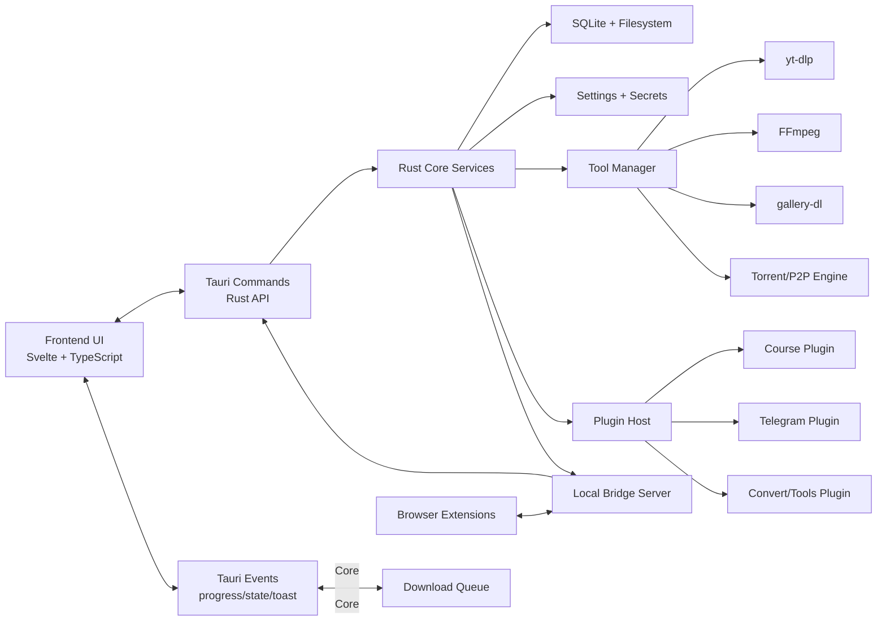
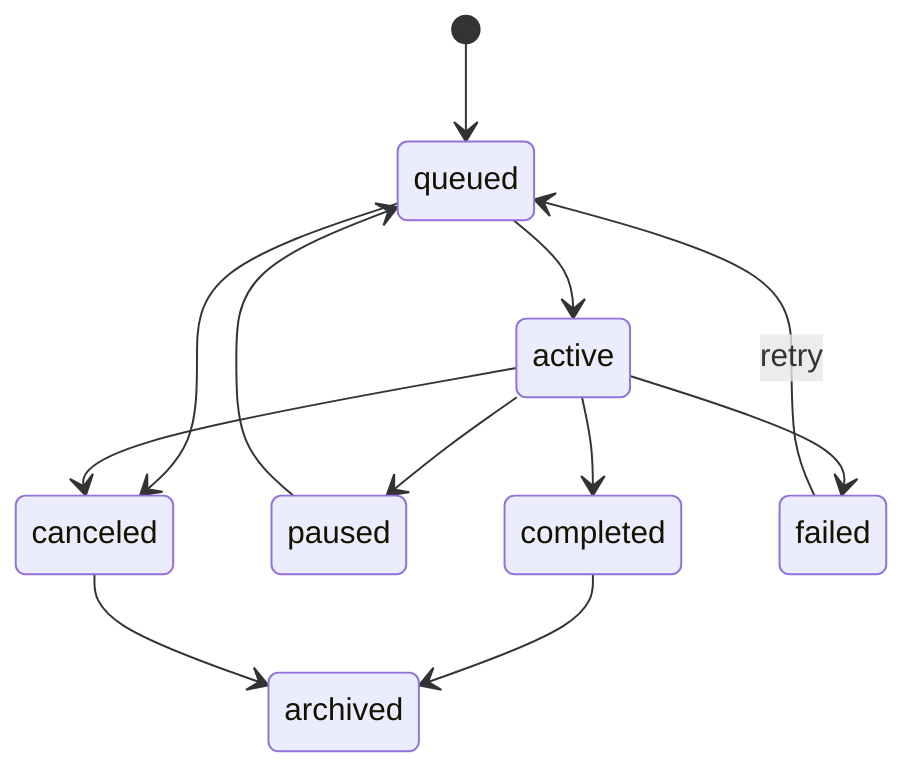

# FetchDock 架构规格

状态：draft
阶段：第一阶段规格盘点
约束：自写实现边界。本文只定义 FetchDock 自有架构，不复制第三方项目源码、资产、文案、品牌或界面细节。

## 目标

FetchDock 是跨平台桌面应用，用一个本地优先的架构覆盖下载、课程、阅读、音乐、Telegram、浏览器扩展、Cookie、依赖管理、插件市场和发布质量能力。第一版架构优先满足目标能力矩阵、可维护、可恢复、可验证，不引入已列入能力之外的新产品能力。

## 技术选型

| 层 | 方案 | 说明 |
| --- | --- | --- |
| 桌面壳 | Tauri 2 | 提供窗口、托盘、deep link、全局快捷键、系统对话框、文件打开、自动更新等桌面能力 |
| 后端 | Rust | 下载队列、插件宿主、依赖管理、SQLite、文件系统、认证、bridge server |
| 前端 | TypeScript + Svelte | 负责 UI、路由、状态展示、用户输入、命令调用和事件订阅；后续如团队更熟 React，可在不改 Rust API 的前提下替换 |
| 存储 | SQLite + 本地文件系统 | SQLite 保存结构化状态；文件系统保存下载文件、缓存、日志、插件、依赖、阅读/音乐资源索引 |
| 下载工具 | yt-dlp、FFmpeg、gallery-dl、torrent/P2P 引擎 | 工具由依赖管理器检测、下载、校验和升级，不要求普通用户预装 Python 或命令行工具 |
| 浏览器扩展 | Chrome + Firefox WebExtension | 通过 localhost bridge、pairing token 和 deep link fallback 把页面、媒体和认证上下文交给桌面应用 |
| 插件 | Rust dynamic library + manifest | 主应用加载受控 ABI 插件；插件失败不能导致主应用崩溃 |

## 架构总览



## 前后端边界

前端只负责用户交互和展示，不直接访问数据库、下载工具、插件动态库、Cookie 文件或依赖二进制。所有副作用都通过 Rust command 或本地 bridge server 完成。

Rust 后端负责：

- 路径解析、portable mode、配置目录、缓存目录、插件目录和依赖目录。
- SQLite schema、迁移、事务和数据一致性。
- 下载队列调度、进度事件、日志、错误分类和恢复。
- 外部依赖检测、下载、校验、升级和执行。
- Cookie bucket、平台认证和敏感数据保护。
- 插件加载、ABI 检查、host API、插件命令与插件事件。
- 浏览器扩展 localhost bridge、pairing token、deep link payload 解析。
- 系统集成：托盘、通知、全局快捷键、文件管理器 reveal、启动项、自动更新。

前端负责：

- 页面路由、侧边栏、命令面板、toast、弹窗、设置表单。
- Omnibox 输入、批量链接导入、下载选项选择。
- 下载列表、任务详情、日志查看、历史筛选。
- 阅读器、音乐库、课程播放器、Telegram UI、插件市场 UI。
- 订阅后端事件并更新本地 view model。
- 在提交命令前做轻量表单校验，但不把前端校验作为安全边界。

## Rust 服务划分

| 服务 | 职责 | 不负责 |
| --- | --- | --- |
| `AppPaths` | 解析普通模式和 portable mode 下的配置、数据库、缓存、插件、依赖、日志路径 | 不创建业务表，不执行业务逻辑 |
| `SettingsService` | 读写设置、默认下载选项、外观、网络、依赖、插件、扩展配置 | 不直接启动下载 |
| `Database` | SQLite 连接池、迁移、事务帮助方法 | 不包含 UI 状态 |
| `DownloadQueue` | 任务状态机、并发调度、暂停/恢复/取消/重试/排序 | 不解析具体平台细节 |
| `DownloaderRegistry` | 根据任务类型选择 yt-dlp、gallery-dl、HTTP、torrent、P2P 或插件下载器 | 不展示进度 |
| `ToolManager` | 检测、下载、校验、升级 yt-dlp/FFmpeg/gallery-dl 等依赖 | 不决定下载业务参数 |
| `PlatformRegistry` | URL 分类、metadata preview、平台能力声明、Cookie health | 不持久化队列状态 |
| `CookieService` | Cookie bucket、导入、导出、匹配、健康检查、平台登录状态 | 不把敏感 cookie 暴露给前端明文，除非用户显式导出 |
| `PluginHost` | 加载插件、ABI 版本检查、manifest 校验、host API、命令转发 | 不信任插件输入 |
| `BridgeServer` | 127.0.0.1 HTTP bridge、pairing token、扩展 payload 验证 | 不接受非本机来源请求 |
| `EventBus` | 统一发送 progress/state/toast/plugin/bridge 事件 | 不持久化事件 |
| `DiagnosticsService` | 日志、诊断包、环境信息、错误报告导出 | 不包含下载内容、cookie、认证 token |

## Rust command API 分层

Tauri commands 只作为边界层。每个 command 做四件事：

1. 反序列化请求。
2. 调用服务层。
3. 把服务错误映射成统一 `AppError`。
4. 返回结构化响应或触发事件。

Command 按领域分组：

| 领域 | 示例命令 |
| --- | --- |
| App | `app_get_status`、`app_open_path`、`app_reveal_file`、`app_export_diagnostics`、`app_export_diagnostics_bundle`、`app_get_local_evidence_snapshot`、`app_export_local_evidence_snapshot` |
| Settings | `settings_get_all`、`settings_update`、`settings_search` |
| Downloads | `downloads_create`、`downloads_list`、`downloads_pause`、`downloads_resume`、`downloads_cancel`、`downloads_retry`、`downloads_delete`、`downloads_reorder` |
| Metadata | `metadata_probe_url`、`metadata_list_formats`、`metadata_list_subtitles`、`metadata_list_thumbnails` |
| Media tools | `media_clip_video`、`media_detect_shots`、`media_generate_waveform_peaks`、`subtitle_workshop_open`、`subtitle_workshop_save` |
| Tools | `tools_get_status`、`tools_install`、`tools_update`、`tools_set_path` |
| Cookies | `cookies_list_buckets`、`cookies_import`、`cookies_export`、`cookies_test`、`cookies_delete` |
| Plugins | `plugins_list`、`plugins_install`、`plugins_enable`、`plugins_disable`、`plugins_uninstall`、`plugins_call_command` |
| Extension | `extension_get_pairing_status`、`extension_create_pairing_token`、`extension_revoke_pairing` |
| Library | `library_scan_books`、`library_open_book`、`library_update_annotation`、`music_scan_folder` |
| Courses | `courses_probe`、`courses_import`、`courses_update_progress` |
| Telegram | `telegram_auth_start`、`telegram_auth_complete`、`telegram_list_chats`、`telegram_download_media` |

API 的精确定义放在 [API_CONTRACTS.md](/e:/Data/Own/Entrepreneurship/FetchDock/docs/API_CONTRACTS.md)。

## 事件模型

Rust 后端通过 Tauri event 向前端广播领域事件。事件只传结构化 JSON，避免把 stdout/stderr 原文无限制推给 UI。

| 事件 | 用途 |
| --- | --- |
| `download:created` | 新任务创建 |
| `download:state` | 任务状态变化 |
| `download:progress` | 任务进度、速度、ETA、文件计数 |
| `download:log` | 任务日志增量 |
| `download:completed` | 任务完成 |
| `download:failed` | 任务失败和错误分类 |
| `tool:status` | 依赖安装/更新状态 |
| `plugin:status` | 插件安装、加载、启用、禁用、失败 |
| `extension:paired` | 扩展配对状态变化 |
| `toast:show` | 统一用户反馈 |
| `settings:changed` | 设置变更 |
| `library:changed` | 书库/音乐库/课程库索引变更 |

事件必须包含：

- `event_id`
- `occurred_at`
- `schema_version`
- `payload`

## 下载队列模型

下载任务是 FetchDock 的核心状态机。任务创建后必须持久化，不能只存在前端内存。

### 任务状态



### 任务实体

每个任务保存：

- `id`
- `kind`: `video | audio | image | pdf | book | webpage | telegram_media | course_lesson | generic | torrent | p2p`
- `source_url`
- `platform`
- `title`
- `thumbnail_path`
- `output_dir`
- `output_files`
- `options`
- `status`
- `position`
- `priority`
- `created_at`
- `updated_at`
- `started_at`
- `finished_at`
- `retry_count`
- `last_error`

### 调度规则

- 活动任务数不得超过 `settings.downloads.max_concurrency`。
- `queued` 按 `priority`、`position`、`created_at` 排序。
- 用户调整顺序只影响 `queued` 任务；`active` 任务不被拖拽重排。
- `pause` 应尽力向 downloader 发送可恢复中断；若工具不支持暂停，则转为取消后保留恢复信息。
- `cancel` 必须停止子进程、释放锁、标记状态，并按设置保留或清理临时文件。
- `retry` 只对可重试错误自动执行；认证、路径、权限、格式不可用等永久错误不自动重试。
- 应用重启时，启动恢复任务扫描上次 `active`、`queued`、`paused` 状态并修正为可恢复状态。

## Downloader adapter

所有下载引擎都实现统一 adapter 接口：

| 方法 | 说明 |
| --- | --- |
| `probe(input)` | 返回预览、格式、字幕、缩略图、文件列表 |
| `start(task, sink)` | 启动下载并向 `sink` 写进度、日志、状态 |
| `pause(task)` | 尝试暂停 |
| `resume(task)` | 从临时文件或工具 resume 信息继续 |
| `cancel(task)` | 停止任务 |
| `classify_error(error)` | 映射统一错误分类 |

首批 adapter：

- `YtDlpAdapter`: 视频、音频、字幕、播放列表、generic sites。
- `GalleryDlAdapter`: 图库、profile、图片批量下载。
- `HttpFileAdapter`: direct file、断点续传、header/referer/user-agent。
- `TorrentAdapter`: magnet、`.torrent`、metadata、file selection、seeding。
- `P2pTransferAdapter`: 短码配对文件传输。
- `PluginAdapter`: 课程、Telegram 等插件贡献的下载任务。

## 插件系统模型

插件目标是隔离可选大模块，并允许 Courses、Telegram、Convert 等功能以默认插件交付。

### 插件包

插件目录包含：

- `plugin.json`
- 平台动态库：Windows `.dll`、macOS `.dylib`、Linux `.so`
- 可选前端资源
- 可选 i18n 文件
- 可选 schema 与默认设置

### Manifest 核心字段

- `id`
- `display_name`
- `version`
- `abi_version`
- `entry`
- `capabilities`
- `commands`
- `events`
- `settings_schema`
- `nav_items`
- `default_enabled`
- `minimum_app_version`

字段名称是 FetchDock 自有 schema，可与常见概念对齐，但不复制外部 manifest 文案。

### ABI 与安全

- 主应用加载前校验 `abi_version`、`minimum_app_version`、平台、架构和签名/校验和。
- ABI 不兼容时拒绝加载并提示用户更新插件。
- 插件初始化、命令调用、事件处理必须捕获 panic 或错误，插件失败不得导致主应用崩溃。
- 插件只能访问 host API 暴露的路径、设置、网络配置和事件能力。
- 插件 data dir 独立，路径由 `AppPaths` 分配。

### Host API

插件可请求：

- 读取自身设置。
- 写入自身设置。
- 获取自身 data dir。
- 发送 toast。
- 发出插件事件。
- 注册下载 adapter 或工具命令。
- 查询全局代理、默认输出目录、依赖路径。
- 读取被授权的 Cookie bucket 引用；默认不能读取明文 cookie。

## 浏览器扩展桥接模型

扩展与桌面应用之间有两条路径：

1. 主路径：`http://127.0.0.1:<port>` localhost bridge。
2. 备用路径：`fetchdock://` deep link。

### Bridge server

- 只监听 loopback 地址。
- 默认端口从配置的端口段自动探测。
- 所有写操作要求 pairing token。
- 请求体大小有限制。
- CORS 只允许扩展 origin 和本机受控页面。
- 认证失败返回 401 并引导重新配对。

### Bridge endpoint

| Endpoint | 方法 | 用途 |
| --- | --- | --- |
| `/health` | GET | 扩展探测桌面 app 是否运行 |
| `/pair/start` | POST | 旧版配对兼容入口，返回手动 token 配对状态，不生成 token |
| `/pair/complete` | POST | 旧版配对完成兼容入口，只校验用户已从桌面/CLI 创建的 token |
| `/v1/extension/download` | POST | 当前主下载入口，发送页面、链接或媒体 URL |
| `/download/page` | POST | 旧版页面下载兼容别名，转换到 `/v1/extension/download` |
| `/download/media` | POST | 旧版媒体下载兼容别名，转换到 `/v1/extension/download` |
| `/download/batch` | POST | 旧版批量发送兼容别名，最多 100 个 URL，逐条转换到 `/v1/extension/download` |
| `/v1/extension/cookies` | POST | 暂存浏览器上下文 Cookie payload，供用户导入 bucket |
| `/cookies/import` | POST | 旧版 Cookie 导入兼容别名，行为等同 `/v1/extension/cookies` 的本地 payload staging |
| `/v1/extension/authorization` | POST | 暂存 Authorization payload ref，不向 UI 返回明文 |

### Deep link

`fetchdock://download?...` 只能传递低敏信息，如 URL、title、platform、source。Cookie、authorization header 等敏感信息不通过 deep link 传递。

Tauri 2 下，Windows/Linux 的 deep link 可能以新进程参数形式进入，需要 single-instance 处理并转交到已运行实例。

## 本地数据存储

### SQLite 数据库

默认数据库路径：

- 普通模式：系统 app data 目录。
- portable mode：可执行文件旁 `data/db/fetchdock.sqlite3`。

当前实现状态：模块 A/B/C 交界处已使用 `data/db/fetchdock.sqlite3` 持久化下载任务，当前 `download_tasks` 表保存 `id`、`position`、完整任务 JSON 和 `updated_at`，并在首次读取时兼容导入旧 `data/db/download-tasks.json`。本地列表、单 URL/多 URL 入队、取消、暂停、恢复、重试、清理完成、删除、顺序调整、任务级输出目录选择/可写校验和 `http://`/`https://` direct-file 后台下载已接入该存储。进程内调度器读取 `data/config/downloads.json` 的 `max_concurrency`（默认 2，当前 UI 限制 1..8）限制 active 任务数，运行任务有取消标志，direct-file 下载使用 `.part` 文件和 `Range` 请求做基础续传，启动恢复会把遗留 `active` 任务退回 `queued`，并写入文件日志。完整模块 C 仍需日志表、更细事务边界、完整文件校验、长任务并发集成验收和外部 downloader adapter。

核心表：

| 表 | 说明 |
| --- | --- |
| `settings` | 全局设置键值 |
| `download_tasks` | 当前任务 |
| `download_task_logs` | 任务日志 |
| `download_history` | 完成和归档记录 |
| `download_files` | 任务输出文件 |
| `cookie_buckets` | Cookie 账号桶 metadata |
| `cookie_entries` | 加密或受保护 cookie |
| `tools` | 依赖工具状态 |
| `plugins` | 插件安装与启用状态 |
| `plugin_settings` | 插件设置 |
| `channels` | 频道订阅 |
| `channel_items` | 频道历史 |
| `books` | 阅读库条目 |
| `book_annotations` | 高亮、书签、笔记 |
| `music_tracks` | 音乐索引 |
| `playlists` | 播放列表 |
| `courses` | 课程条目 |
| `course_lessons` | 课程 lesson |
| `notes` | 学习笔记 |
| `events_audit` | 关键状态变更审计 |

### 文件系统布局

```text
data/
  config/
  db/
  downloads/
  cache/
    thumbnails/
    waveform/
    metadata/
  cookies/
  dependencies/
    yt-dlp/
    ffmpeg/
    gallery-dl/
  plugins/
    installed/
    staging/
  logs/
  diagnostics/
```

普通模式使用系统目录下相同逻辑布局；portable mode 使用可执行文件旁的 `data`。

## 配置模型

设置分为三层：

1. App defaults：编译内置默认值。
2. User settings：用户在设置页保存的全局配置。
3. Task overrides：单个下载任务的临时覆盖项。

优先级：`Task overrides > User settings > App defaults`。

敏感信息单独存储，不进入普通 settings 表：

- Cookie。
- pairing token。
- 平台登录 token。
- API key 或 AI provider key。

## 日志与诊断

日志分四类：

| 类型 | 保存位置 | 用途 |
| --- | --- | --- |
| App log | `logs/app.log` | 启动、窗口、设置、系统错误 |
| Download log | `download_task_logs` + 文件日志 | 单任务 stdout/stderr 摘要和状态 |
| Plugin log | `logs/plugins/<plugin_id>.log` | 插件加载和命令错误 |
| Bridge log | `logs/bridge.log` | 扩展连接、配对、错误，不记录敏感 header 明文 |

诊断包包含：

- 应用版本、平台、架构。
- 数据库迁移版本。
- 依赖工具版本和路径摘要。
- 插件列表和加载状态。
- 最近错误日志。

诊断包不得包含：

- 下载文件内容。
- Cookie 明文。
- Authorization header。
- pairing token。
- 用户完整下载 URL 列表；除非用户显式选择包含。

## 错误处理

统一错误分类：

| 分类 | 示例 | 是否自动重试 |
| --- | --- | --- |
| `network` | DNS、连接超时、临时 5xx | 是 |
| `rate_limited` | 429、平台限流 | 是，使用 backoff |
| `auth_required` | 未登录、Cookie 过期 | 否 |
| `permission_denied` | 私有内容无权限 | 否 |
| `not_found` | 内容不存在或被删除 | 否 |
| `unsupported_url` | 无 adapter 可处理 | 否 |
| `format_unavailable` | 目标质量/格式不存在 | 否 |
| `path_invalid` | 输出目录不可写或非法 | 否 |
| `dependency_missing` | yt-dlp/FFmpeg/gallery-dl 不可用 | 否，先修复依赖 |
| `dependency_failed` | 工具进程异常退出 | 视 stderr 分类 |
| `plugin_incompatible` | ABI/版本不兼容 | 否 |
| `plugin_failed` | 插件命令错误 | 视插件错误声明 |
| `internal` | 未预期异常 | 否，导出诊断 |

所有错误响应必须带：

- `code`
- `message`
- `category`
- `retryable`
- `user_action`
- `details_id`

## 恢复机制

启动恢复顺序：

1. 初始化 `AppPaths`，判断 ordinary/portable mode。
2. 打开 SQLite，执行迁移。
3. 加载 settings 和 secrets。
4. 启动日志系统。
5. 检测依赖工具状态。
6. 加载插件 manifest，延迟加载动态库。
7. 启动 bridge server。
8. 注册 deep link、全局快捷键、托盘。
9. 扫描上次未完成下载任务。
10. 把上次 `active` 任务转为 `queued` 或 `paused`，根据临时文件和 adapter 能力决定是否可恢复。
11. 广播 `download:state` 和 `tool:status`。

恢复原则：

- 不默默丢弃任务。
- 不伪造完成状态。
- 不自动重试永久错误。
- 不删除用户输出文件，除非用户确认。
- 插件加载失败不阻塞核心应用启动。

## 模块实现顺序

1. 完成规格文档：能力地图、架构、API 合约、验收清单。
2. 搭建最小 Tauri 应用壳和路径服务。
3. 建立 SQLite schema、settings、事件总线。
4. 实现下载队列数据模型和状态机。
5. 接入最小 URL 检测与 yt-dlp 下载闭环。
6. 实现下载页、任务状态、日志、依赖管理、Cookie。
7. 扩展平台 adapter、gallery-dl、torrent/P2P。
8. 实现插件宿主、课程、Telegram、Convert/工具模块。
9. 实现阅读、音乐、学习辅助、浏览器扩展。
10. 完成发布、自动更新、诊断、法务与构建文档。

每个模块完成后必须同步更新 [CAPABILITY_MAP.md](/e:/Data/Own/Entrepreneurship/FetchDock/docs/CAPABILITY_MAP.md) 和 [ACCEPTANCE.md](/e:/Data/Own/Entrepreneurship/FetchDock/docs/ACCEPTANCE.md)。
